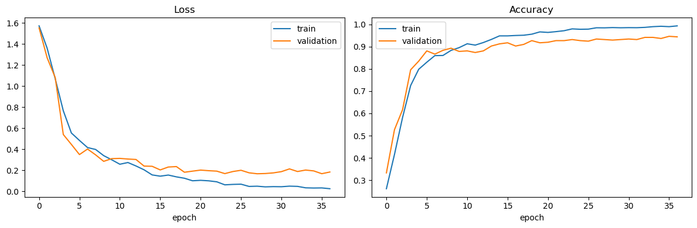
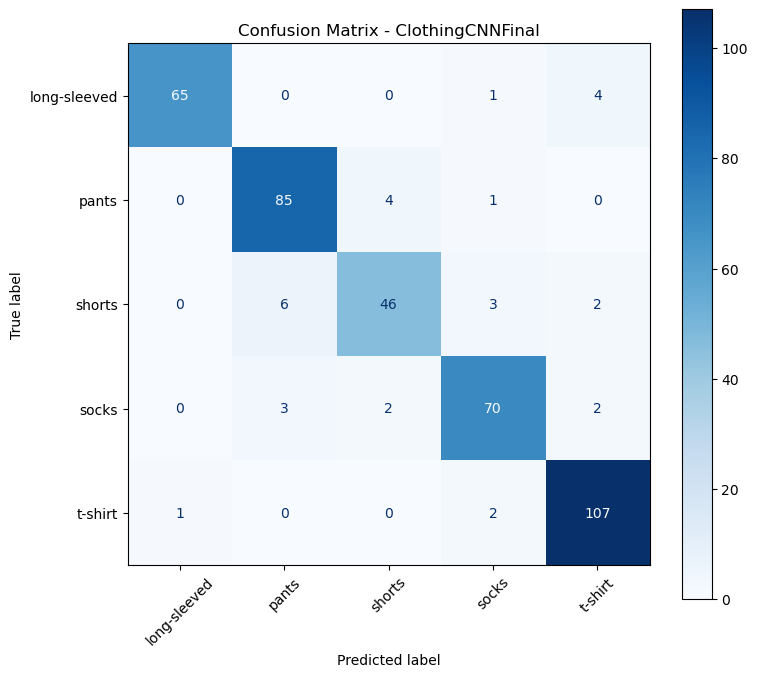

# Clothing Image Classification with a Compact CNN

[](https://www.python.org/)
[](https://pytorch.org/)

An end-to-end deep-learning project for classifying clothing product images into five categories. The model is trained **from scratch** in PyTorch and deliberately kept below 800,000 trainable parameters.

**Kurzbeschreibung (DE):** Entwicklung und Evaluation eines kompakten CNN zur Klassifikation von Kleidungsbildern. Der Workflow umfasst Datenprüfung, Augmentation, klassenbalanciertes Sampling, Early Stopping, Fehleranalyse und reproduzierbare Testauswertung.

## Highlights

- Custom CNN with inverted residual and depthwise-separable convolution blocks
- 794,485 trainable parameters
- Class-balanced sampling and image augmentation
- Early stopping and adaptive learning-rate scheduling
- Reproducible dataset audit for exact cross-split duplicates
- Standalone training, evaluation and single-image prediction scripts
- Experiment tracking with optional Weights & Biases integration in the notebook

## Reported results

| Metric | Result |
|---|---:|
| Test accuracy | **92.33%** |
| Macro F1-score | **91.68%** |
| Weighted F1-score | **92.28%** |
| Test set | 404 images |

The executed notebook contains the complete training history, classification report, confusion matrix and error analysis. See [MODEL_CARD.md](MODEL_CARD.md) for interpretation and limitations.

> **Checkpoint note:** The final checkpoint referenced by the notebook was not present in the original submission files. A different checkpoint was found but excluded after verification because it achieved only 41.58% on the test set. Run the cleaned training pipeline to generate a trustworthy checkpoint.

### Training behaviour



### Confusion matrix



The strongest confusion occurs between visually related lower-body categories, especially `shorts` and `pants`. The notebook also contains a confidence-sorted review of misclassified samples.

## Dataset

The dataset contains 4,218 images across five classes:

| Split | Images |
|---|---:|
| Train | 3,402 |
| Validation | 412 before duplicate removal |
| Test | 404 |

One exact duplicate was detected between the training and validation splits. The preparation script removes the validation copy, leaving 411 validation images and preventing this known leakage.

The images are intentionally not committed. Before redistributing the dataset, verify its original licence and source.

## Quick start

```bash
git clone https://github.com/pc-mt/clothing-image-classification-cnn.git
cd clothing-image-classification-cnn

python -m venv .venv
# Windows: .venv\Scripts\activate
# Linux/macOS: source .venv/bin/activate
pip install -r requirements.txt
```

Prepare and audit the local dataset archive:

```bash
python scripts/prepare_dataset.py /path/to/clothing_clean_5classes_split_audit_copy.zip
```

Train the model:

```bash
python train.py
```

Evaluate the generated checkpoint:

```bash
python scripts/evaluate.py
```

Predict one image:

```bash
python predict.py path/to/image.jpg
```

## Project structure

```text
.
├── assets/               # Result figures used in this README
├── data/                 # Local dataset only; ignored by Git
├── models/               # Generated checkpoints; ignored by Git
├── notebooks/
│   └── clothing_cnn_training.ipynb
├── scripts/
│   ├── audit_dataset.py
│   ├── evaluate.py
│   └── prepare_dataset.py
├── src/
│   └── model.py
├── MODEL_CARD.md
├── predict.py
├── requirements.txt
└── train.py
```

## Reproducibility

- Random seed: `42`
- Train-only augmentation
- Validation and test loaders are never shuffled
- Deterministic cuDNN settings in the standalone training script
- Best checkpoint selected using validation loss only
- Test split used once for the final report

## Author

**Priscille Moumani**

Computer Science student at Technische Hochschule Mittelhessen

[LinkedIn](https://www.linkedin.com/in/priscille-moumani-43506b350/) · [GitHub](https://github.com/pc-mt)
